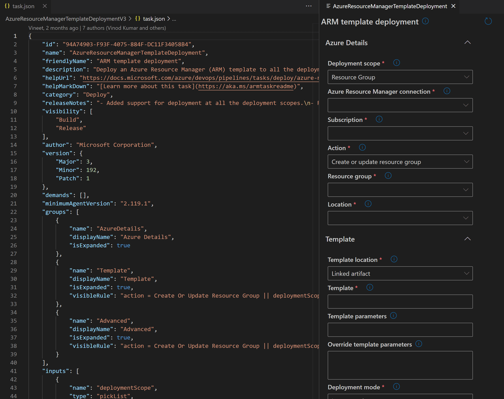

# AzDevops task.json viewer

## Features
### View task.json of an Azure DevOps extension
 

Supported :
- input types
- visibility rules
- input validation
- collapsible groups
- help markdown
- validation : based on https://github.com/microsoft/azure-pipelines-task-lib/blob/master/tasks.schema.json

Not supported :
- fully data source binding (only simulated)

 

## Usage
  

